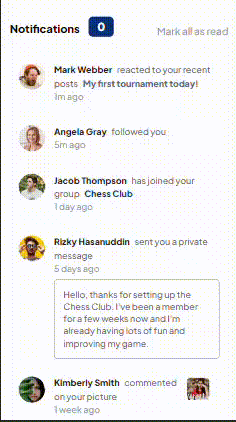

# Frontend Mentor - Notifications page solution

This is a solution to the [Notifications page challenge on Frontend Mentor](https://www.frontendmentor.io/challenges/notifications-page-DqK5QAmKbC). Frontend Mentor challenges help you improve your coding skills by building realistic projects.

## Table of contents

- [Overview](#overview)
  - [The challenge](#the-challenge)
  - [Screenshot](#screenshot)
- [My process](#my-process)
  - [Built with](#built-with)
  - [What I learned](#what-i-learned)
  - [Continued development](#continued-development)
- [Author](#author)

## Overview

### The challenge

Users should be able to:

- Distinguish between "unread" and "read" notifications ✔️
- Select "Mark all as read" to toggle the visual state of the unread notifications and set the number of unread messages to zero ✔️
- View the optimal layout for the interface depending on their device's screen size ✔️
- See hover and focus states for all interactive elements on the page ✔️

### Screenshot

|                            Desktop                             |                        Mobile                        |
| :------------------------------------------------------------: | :--------------------------------------------------: |
|  |  |

### Links

- You can see [my solution here](https://www.frontendmentor.io/solutions/tip-calculator-app-gKJCg6ZXJR)
- Go to the [live site](https://fm-notifications-page-two.vercel.app/)

## My process

### Built with

- [HTML](https://developer.mozilla.org/en-US/docs/Learn/Getting_started_with_the_web/HTML_basics)/[CSS](https://www.w3.org/Style/CSS/Overview.en.html)
- [JavaScript](https://www.javascript.com/)
- [Tailwind CSS](https://tailwindcss.com/)
- [Vite](https://vitejs.dev/)

### What I learned

This challenge helped me become more familiar with working with the tailwind config file. I have a better understanding of how to customize tailwind to fit my preferences.

## Author

<!-- - Website - [Add your name here](https://www.your-site.com) -->

- Frontend Mentor - [@memoye](https://www.frontendmentor.io/profile/memoye)
- Twitter - [@memoye_io](https://www.twitter.com/memoye_io)
